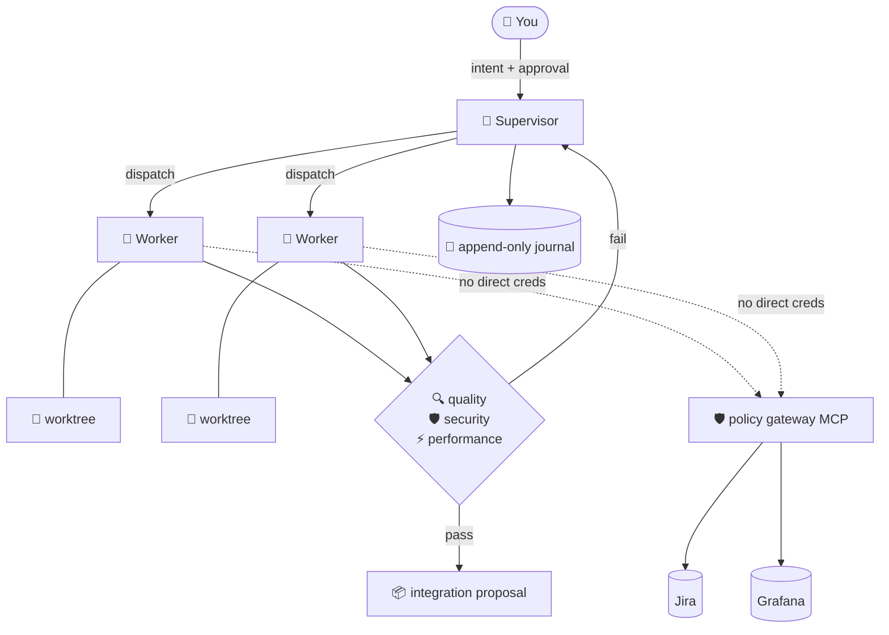

<div align="center">


### Claude Code, but it ships the whole change set 🦀✨

Crabgic turns Claude into an **autonomous engineering orchestrator**. It plans the work,
hands each piece to a sandboxed worker in its own git worktree, and refuses to propose
anything that has not survived quality, security, and performance gates.

You show up for two decisions. It does the rest. 🎩

[](https://www.npmjs.com/package/crabgic)
[](./LICENSE)
[](https://nodejs.org)
[](./docs/compatibility-matrix.md)

</div>

---

## 🦀 What is this?

Most AI coding tools hand you a diff and wish you luck. Crabgic runs the **whole loop**:

```
  intent  →  plan  →  workers in isolated worktrees  →  gates  →  evidence  →  proposal
                            🦀 🦀 🦀                    🔍🛡️⚡        📜
```

Every worker runs on **your** Claude subscription through the Agent SDK's in-process
transport, boxed in by an `AuthorizationEnvelope` compiled down to native Claude Code
permission and sandbox profiles. Jira and Grafana never see a worker — all connector
traffic goes through a single policy-gateway MCP server. Nothing reaches your branch
until the gates say so, and every decision leaves an `EvidenceRecord` behind. 📜

> 🦀 **Crab's honest note:** the design goal is full autonomy end to end. A human is
> required at exactly two blocking gates (three if you count learning promotion), and
> nowhere else.

## 🎬 Quickstart

```bash
# 1. install the CLI  📦
npm install -g crabgic

# 2. set up this project — writes a managed CLAUDE.md block,
#    .claude/settings.json keys, the eo-* subagents, the status line
#    and the gateway MCP entry
cd your-project
crabgic install            # add --dry-run first if you like to look before you leap 👀

# 3. make sure the host is actually healthy  🩺
crabgic doctor

# 4. hand it some work — run reads an intake request as JSON on stdin
crabgic run < intake.json
```

Work covered by the standing policy you approved at install time goes straight to a
dispatched run — no prompt, no token, nothing to confirm. Work that reaches outside it
stops and tells you exactly which authority it needs; you approve that at your own
terminal with `crabgic approve <envelope-digest>`, and it starts.

> 🦀 **Crab tip:** from inside a Claude Code session you don't write the JSON yourself —
> `/eo:run` drafts the intake request from the conversation and hands it to the CLI.

Then watch it go:

```bash
crabgic status <run-id> --watch     # 👀 live
crabgic evidence <change-set-id>    # 📜 what it did and why you should believe it
```

> 🦀 **Crab tip:** `crabgic install` is add-only and byte-preserving. It never runs
> `git add` or `git commit` for you, and `git init` on a non-repo is gated behind an
> explicit approval.

## 📊 The status line

`crabgic install` also drops a status line into your Claude Code session, so the
numbers that decide whether you should keep going are always on screen:

```text
🦀 Opus 5 1M·hi │ ⎇ main* │ ▰▰▰▰▱▱▱▱▱▱ 38% │ 🕐 24% │ 📅 41%
```

| Segment | What it is |
| --- | --- |
| `🦀 Opus 5 1M·hi` | Model and its reasoning effort (`lo`/`md`/`hi`/`xh`/`max`); `⚡` marks fast mode |
| `⎇ main*` | Current branch — `*` means the working tree is dirty |
| `▰▰▰▰▱▱▱▱▱▱ 38%` | Session context window used |
| `🕐 24%` | 5-hour usage limit consumed |
| `📅 41%` | Weekly usage limit consumed |

All three meters share one green → amber → red scale. Once a usage window passes
80% it also shows how long until it resets (`🕐 87%↻1h16m`) — before that the
countdown stays out of the way.

A few things worth knowing:

- **The two usage segments appear once your session makes its first request.** Claude
  Code only learns your limits from a response header, and only for Claude.ai
  subscriptions — so a brand-new session, or an API-key session, shows neither.
- **It never overwrites a status line you already have.** Like every other key the
  installer touches, `statusLine` is add-only: if you configured your own, yours stays.
- **No emoji in your font?** Set `CRABGIC_STATUSLINE_ASCII=1` for a plain-glyph line.
  `NO_COLOR` is honoured too.

## 🎩 Driving it from inside Claude Code

`crabgic install` registers the plugin for the project, so the skills are just there:

| Skill | What it does |
| --- | --- |
| `/eo:run` | 🚀 Start a run against the current change intent |
| `/eo:status` | 👀 Show or live-watch a run |
| `/eo:evidence` | 📜 Pull the recorded evidence for a change set |
| `/eo:connections` | 🔌 List and inspect Jira / Grafana connections |
| `/eo:approve` | 🔐 Approve a pending envelope — **never** model-invocable |
| `/eo:protocol` | 🤖 The manager's operating protocol — when it keeps going, when it stops, how it asks |

It also brings two subagents — `eo-explore` (haiku, cheap and fast) and `eo-reviewer`
(sonnet, does the reading) — plus two advisory hooks that are always non-blocking.

Prefer wiring the plugin yourself? The marketplace is `crabgic-marketplace`:

```bash
claude plugin marketplace add <package root>
claude plugin install crabgic@crabgic-marketplace --scope project
claude plugin enable  crabgic@crabgic-marketplace --scope project
```

## 🛠️ Driving it from the terminal

The full command surface, straight from `crabgic --help`:

| Command | What it's for |
| --- | --- |
| `crabgic install [--dry-run] [--json]` | 📦 Install the plugin / managed config into this project |
| `crabgic doctor [--repair-plan] [--json]` | 🩺 Validate the host end-to-end against seeded fault checks |
| `crabgic run [--json]` | 🚀 Dispatch a new run |
| `crabgic approve <envelope-digest>` | 🤝 Approve a pending envelope at your terminal (human-only escalation path) |
| `crabgic status [run-id] [--watch] [--json]` | 👀 Show (or stream) a run's status |
| `crabgic resume <run-id>` | ▶️ Resume a parked or interrupted run |
| `crabgic cancel <run-id\|task-id>` | 🛑 Cancel a run or a task within it |
| `crabgic evidence <change-set-id>` | 📜 Show every `EvidenceRecord` for a change set |
| `crabgic connection add\|list\|doctor\|capabilities` | 🔌 Manage connector connections |
| `crabgic trust review\|approve\|revoke` | 🔐 Review high-impact capability grants |
| `crabgic learn list\|approve\|reject\|rollback` | 🧠 Manage reviewed learning proposals |
| `crabgic upgrade [--dry-run]` | ⬆️ Upgrade the installed plugin / managed config |
| `crabgic uninstall [--keep-state]` | 👋 Remove it again |
| `crabgic gateway mcp` | 🛡️ Boot the gateway MCP server over stdio |

The supervisor daemon starts on demand — there is no daemon to babysit. 😌

## 🤖 How autonomous it actually is

Once a run is approved, the manager session is supposed to drive it to completion without
checking in — and it is held to that, not merely asked. `crabgic install` writes an
operating protocol into your project's `CLAUDE.md`, and a `Stop` hook refuses to let a
turn end while a run is still in flight. 🦀

It will **never** ask you to type "continue". It stops for exactly seven reasons — a
material amendment, expanded authority, a critical security issue, an unsafe overlap, an
irreducible product decision, exhausted repairs, or a blocking verification failure — plus
the approval gates below. Run `/eo:protocol` in a session to read the long version.

When it *does* need a decision from you, it asks through Claude Code's own question UI
with real options and a notes field — never a plain-text "1 / 2 / 3 / 4" list.

> 🦀 **Crab tip:** the gate fails open by design. No supervisor, no runs, a timeout, or any
> error at all and your turn just ends normally. It can't trap a session, and it never
> fires in a project that isn't running Crabgic.

## 🔐 Where you actually stay in the loop

Two blocking gates — plus one more if you turn on learning. All of them live in your
terminal, and none can be reached by a model, a script, or a CI job.

- **🤝 Envelope approval** — before out-of-policy work runs, `crabgic approve <digest>`
  prints what the envelope actually grants (change set, owned paths, commands, network
  destinations, credential references) and waits for you to type `yes`. Exactly `yes`.
  The token it mints is single-use (durable ledger), HMAC-signed, verified against that
  change set's own *stored* digest, and spent in the same process before the command
  returns — it is never printed, so nothing can courier it. The prompt is refused
  outright on a piped stdin, and refused when the process carries agent-runtime or CI
  provenance in its environment. **Honest limit:** a determined caller that allocates a
  pty *and* scrubs those markers can still drive the prompt — no in-process check can
  tell a typed `yes` from a written one. That is why the standing policy, not this
  prompt, is the primary control.
- **📜 The standing policy** — authored once, by you, at `crabgic install`, which now
  refuses to write one from an agent or CI shell. No tool, command or skill offers to
  widen it. It is your own 0600 file, though — sandboxed workers cannot reach it, a
  session running as you can, and [`docs/security-posture.md`](./docs/security-posture.md)
  says exactly where that line falls.
- **🕵️ Capability quarantine** — `crabgic trust review` shows capability grants that
  crossed the high-impact line; `approve` and `revoke` are yours.
- **🧠 Learning promotion** — `crabgic learn approve` twice, on two separate invocations,
  before a proposal is ever promoted. There is deliberately no MCP tool family for
  learning at all, and a CI check greps to keep it that way.

## 🔌 Connectors

Jira (Cloud + Data Center) and Grafana (Cloud / OSS / Enterprise), all behind the policy
gateway with exactly-once mutation and read-back verification.

```bash
crabgic connection add jira \
  --base-url https://your-org.atlassian.net \
  --reference env:JIRA_TOKEN
```

Secrets are passed **by reference, never by value** — `env:NAME`, `op://…`, `vault://…`,
`file:///abs/path`, or `ref:<opaque-id>`. Paste an actual token and it gets rejected on
sight. 🚫🔑

## 🧭 How the pieces fit



Roughly 70–75% of this is engine-agnostic. The Claude-specific parts sit behind an
`EngineAdapter` boundary — Claude Code is the only adapter built and tested in v1.

## 📦 Requirements

- **Node.js ≥ 24**
- **Linux x86-64 / ARM64**, including WSL2
- A **Claude subscription** — workers run on yours, via the Agent SDK
- `claude` CLI in the accepted range **2.1.207 – 2.1.220** (see
  [`docs/compatibility-matrix.md`](./docs/compatibility-matrix.md))

Published to npm with provenance attestation from a tag-triggered workflow. ✅

## 📚 Docs

| Doc | What's in it |
| --- | --- |
| [`docs/operator-guide.md`](./docs/operator-guide.md) | 🧭 The end-to-end user flow, command by command |
| [`docs/upgrade-guide.md`](./docs/upgrade-guide.md) | ⬆️ Upgrading and uninstalling |
| [`docs/compatibility-matrix.md`](./docs/compatibility-matrix.md) | 🔢 Every supported version, with evidence |
| [`docs/security-posture.md`](./docs/security-posture.md) | 🛡️ Trust boundaries and controls |
| [`docs/threat-model.md`](./docs/threat-model.md) | 🕵️ What we assume an attacker can do |
| [`docs/engine-baseline.md`](./docs/engine-baseline.md) | ⚙️ Pinned engine facts — cite this, never memory |
| [`docs/claude-code-adaptation.md`](./docs/claude-code-adaptation.md) | 📐 The design doc behind all of it |

## 🚧 Known gaps

Being straight with you, because a green README that lies is worse than no README:

- `crabgic connection capabilities` is declared and backed, but the shipped binary never
  supplies the discoverer, so it still answers `NOT_IMPLEMENTED`. It is the last entry on
  the deferral allowlist at
  [`e2e/live/src/knownDeferredAllowlist.ts`](./e2e/live/src/knownDeferredAllowlist.ts),
  which is the list — there is no other one.
- Registering a live Jira/Grafana connection needs real credentials and is still deferred;
  connector calls answer with a typed *connection not registered* error until it lands.
- `cancel` works at run level today; task-level cancellation is still coming.
- **A worker's gateway calls are not adjudication-journaled.** The Agent SDK shadows
  `canUseTool` for tools named outright in `allowedTools`, which is how the gateway family
  is granted — so the per-call fail-closed bridge never fires for them. Found by running a
  real worker, not by reading the code. The static permission and sandbox layers are
  unaffected; see [`docs/security-posture.md`](./docs/security-posture.md).
- **The approval gate stops an opportunistic agent, not an evasive one.** A caller that
  allocates a pty *and* scrubs the agent-runtime environment markers can drive the prompt;
  and the standing policy is your own 0600 file, so a session running as you can rewrite
  it. The policy is a boundary against sandboxed workers, which is the boundary the design
  rests on — the honest scope of both is written up in
  [`docs/security-posture.md`](./docs/security-posture.md).
- **Long project paths break the daemon.** A unix socket path over 108 bytes fails with
  `listen EINVAL`, and the socket path is derived from your XDG state root, so a deeply
  nested checkout cannot start a supervisor.
- Live Jira Data Center conformance is still cassette-modelled rather than run against a
  real instance.

## ⚠️ Version drift

Claude Code ships weekly. Anything engine-touching — permission syntax, hook behaviour,
sandbox schema, session semantics — must cite
[`docs/engine-baseline.md`](./docs/engine-baseline.md) and the pinned range it records.
Never memory, and never this README. 🦀

## 🤝 Contributing

Start with [`CONTRIBUTING.md`](./CONTRIBUTING.md). The ground rules that govern every
change — TDD, coverage thresholds, evidence-based exit criteria, the definition of
"done" — live at the top of [`roadmap/README.md`](./roadmap/README.md).

## 📄 License

[Apache-2.0](./LICENSE). Go build something. 🦀🎩✨
