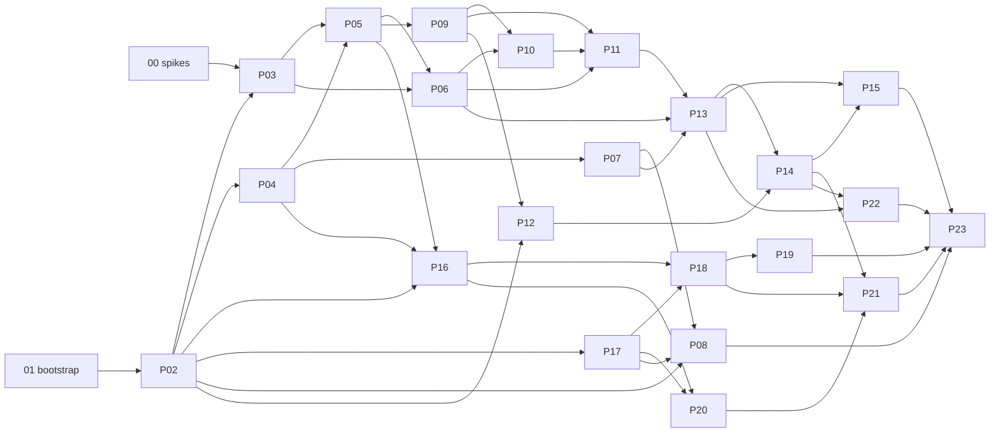

# Engineering Orchestrator — Roadmap

Decomposition of the full v1 plan (see `docs/claude-code-adaptation.md`, esp. §0 confirmed decisions) into small, independently verifiable phases. One file per phase.

**Ground rules (apply to every phase):**

- **TDD is mandatory:** failing tests first, then implementation, then independent review; security review whenever the attack surface changes; exact-candidate verification before the phase closes (original plan requirement).
- **Coverage:** ≥80% line+branch on all new code (greenfield project rule).
- **Exit criteria are evidence, not claims:** each checkbox must map to a CI run, journal entry, or committed artifact.
- **A phase is "done"** when its exit criteria all pass on the exact merge candidate, its docs are updated, and downstream phases' interfaces are unblocked.
- Engine facts drift fast (Claude Code ships weekly). Anything engine-touching cites `docs/engine-baseline.md` (produced in phase 00) and the pinned version range — never memory.

## Phase index

| # | File | Title | Depends on |
|---|---|---|---|
| 00 | `00-engine-spikes.md` | Engine verification spikes & baseline | — |
| 01 | `01-repo-bootstrap.md` | Monorepo bootstrap, toolchain & CI | — |
| 02 | `02-contracts-and-schemas.md` | Core contracts, state machines, canonical errors | 01 |
| 03 | `03-envelope-compiler-engine-adapter.md` | EngineAdapter contract + envelope compiler + fake engine | 00, 02 |
| 04 | `04-journal-idempotency-leases.md` | Event journal, snapshots, idempotency, leases | 02 |
| 05 | `05-supervisor-daemon.md` | Supervisor daemon & UDS control plane | 03, 04 |
| 06 | `06-claude-engine-adapter.md` | Claude Code worker runtime (SDK transport) | 03, 05 |
| 07 | `07-git-control-repo-worktrees.md` | Git engine: control repo, worktrees, overlap analysis | 04 |
| 08 | `08-integration-publication.md` | Merge preflight, CAS refs, neutral Git rendering, local publish | 02, 07, 17 |
| 09 | `09-cli-and-doctor.md` | `engineering-orchestrator` CLI & doctor | 05 |
| 10 | `10-plugin-and-installer.md` | Claude Code plugin, installer, upgrade/uninstall | 06, 09 |
| 11 | `11-intake-contract-approval.md` | Intake, IntentContract, approval envelope flow | 06, 09, 10 |
| 12 | `12-stack-detection-quarantine.md` | Stack detection & capability quarantine | 02, 09 |
| 13 | `13-scheduler-packets-context.md` | Scheduler, task packets, caching, limit parking | 06, 07, 11 |
| 14 | `14-quality-security-gates.md` | Quality & security verification gates | 12, 13 |
| 15 | `15-performance-contracts.md` | PerformanceContract & benchmarking harness | 13, 14 |
| 16 | `16-gateway-core.md` | Connector gateway core: transport, secrets, op journal | 02, 04, 05 |
| 17 | `17-renderer-communication-lint.md` | Shared-text renderer & blocking artifact lint | 02 |
| 18 | `18-jira-cloud-adapter.md` | Jira Cloud adapter + intake/milestone sync | 16, 17 |
| 19 | `19-jira-datacenter-adapter.md` | Jira Data Center adapter | 18 |
| 20 | `20-grafana-adapters.md` | Grafana Cloud/OSS/Enterprise adapters | 16, 17 |
| 21 | `21-connector-evidence-integration.md` | Connector evidence ↔ contracts/verification, drift CI | 14, 18, 20 |
| 22 | `22-learning-system.md` | Reviewed learning pipeline & local evals | 13, 14 |
| 23 | `23-release-hardening.md` | E2E matrix, security review, packaging, publication | all |

## Dependency graph

Critical path: 00/01 → 02 → 03/04 → 05 → 06/09 → 10 → 11 → 13 → 14 → 15 → 23. The connector line (16 & 17 → 18/20 → 21) can proceed in parallel once 02/04/05 exist.

## Mapping to the original plan's 10 phases

| Original phase | Roadmap phases |
|---|---|
| 1. Schemas, invariants, threat model, fixtures | 02, 03 (+00, 01 as prerequisites) |
| 2. Journal, leases, idempotency, supervisor, sandboxing, crash recovery | 04, 05, 06 |
| 3. Control clone, worktrees, branch/commit rendering, integration, local publication | 07, 08 |
| 4. CLI, plugin, installer, managed config, upgrade/uninstall, doctor | 09, 10 |
| 5. Stack detection, capability quarantine, role selection, context projection, scheduling | 12, 13 (+11 for the approval flow) |
| 6. Connection, transport, operation-journal, output-lint, plan/apply layers | 16, 17 |
| 7. Jira Cloud/DC/Agile adapters + milestone sync | 18, 19 |
| 8. Grafana adapters | 20 |
| 9. Connector evidence into contracts/verification/perf/security/learning | 21 (+14, 15) |
| 10. Live testing, security review, profiling, compatibility docs, release | 23 (+22 learning) |
