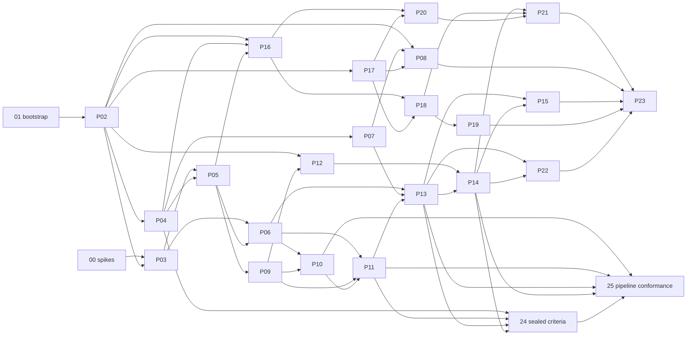

# Crabgic — Roadmap

Decomposition of the full v1 plan (see `docs/claude-code-adaptation.md`, esp. §0 confirmed decisions) into small, independently verifiable phases. One file per phase.

**Ground rules (apply to every phase):**

- **TDD is mandatory:** failing tests first, then implementation, then independent review; security review whenever the attack surface changes; exact-candidate verification before the phase closes (original plan requirement).
- **Coverage:** ≥80% line+branch on all new code (greenfield project rule).
- **Exit criteria are evidence, not claims:** each checkbox must map to a CI run, journal entry, or committed artifact.
- **A phase is "done"** when its exit criteria all pass on the exact merge candidate, its docs are updated, and downstream phases' interfaces are unblocked.
- Engine facts drift fast (Claude Code ships weekly). Anything engine-touching cites `docs/engine-baseline.md` (produced in phase 00) and the pinned version range — never memory.

## Completion ledger — read this before trusting a checkbox

**Phase 23 is closed and evidenced.** Its sixteen exit criteria are ticked against
`release-e2e` run
[30250453824](https://github.com/WitchyNibbles/crabgic/actions/runs/30250453824), which
scored 15 PASS / 0 FAIL in `final` mode at release candidate `2435cb9` with 160 linked
`EvidenceRecord`s. `crabgic@1.0.0` is published with provenance.

> **Correction (2026-08-04), from phase 23's own closeout pass — three parts, none of them
> cosmetic.** The paragraph above is left verbatim; this is what walking its evidence found.
>
> 1. **The link count is wrong.** It entered this ledger in PR #83, hours before this pass, and
>    it is an error rather than a rounding. Run 30250453824's
>    archived report links **158** evidence entries across **103** distinct `EvidenceRecord`s,
>    not 160. The 160 belongs to the **v1.5.0** report. Both archived reports are now committed
>    verbatim under `docs/evidence/phase-23/closeout/` so the count is checkable without GitHub.
> 2. **That run's checkout was not its candidate.** Its `head_sha` is `dbb83fd` — it executed a
>    tree two commits ahead of the `2435cb9` it stamped on every record. Not cosmetic: one of
>    those two commits re-points the marketplace entry at the release commit, and the pin check
>    accepts an ancestor pin only when the intervening span touches nothing but the plugin
>    manifest directory. At the attested candidate that condition is false, so the
>    reproducible-build item's pin clause passed because of the skew.
> 3. **A fresher, skew-free `final` PASS exists that this ledger predates.** Since 2026-07-30
>    `publish.yml` calls `release-e2e` as a blocking gate, so the v1.5.0 tag re-ran the whole
>    matrix: run
>    [30581930006](https://github.com/WitchyNibbles/crabgic/actions/runs/30581930006), 15/15 in
>    `final` mode at `6b9dd7b`, where checkout and candidate are the same commit. That is the
>    primary citation in `docs/evidence/criteria-closeout/phase-23.json`.
>
> **And the sixteen ticks are now thirteen.** Walking them per criterion left three unticked —
> the two "pass live" boxes (crash-recovery/limit-park resume, and Jira/Grafana exactly-once)
> and the release-docs citation box — each with a defect record. Phase 23's grandfathered
> exemption from the ticks-need-a-record rule is closed along with it.

**Closeout status (2026-08-02): 211 criteria across the 25 phases; 161 ticked, 50 not.**
Twenty-one phases now carry a per-criterion closeout record under
`docs/evidence/criteria-closeout/`, each validated by `npm run check:criteria-closeout`.
Four phases have no record yet: **00** (5 criteria) and **06** (10) are live-engine-gated
and need owner approval to run; **19** (7) is not yet started;
**23** (16, all ticked) predates the record format — see below.

> **Updated 2026-08-04.** Phase 23 now carries a record too, so **twenty-two** phases are
> recorded and **three** are not: 00, 06 and 19. Its closeout unticked three of its sixteen
> boxes, which moves the running tally to **211 criteria; 158 ticked, 53 not**. Phase 23 was
> also the single phase exempt from the ticks-need-a-record rule; that exemption was removed
> from `scripts/check-criteria-closeout.mjs` in the same change, so no phase holds one now.

> **Updated 2026-08-04 (wave close, integrator pass).** Phase 19 now carries a record as well —
> closed at **2 of 7**, with four defect records — so **twenty-three** of the twenty-five phases
> are recorded. The two without records, **00** (5 criteria) and **06** (10), are
> live-engine-gated and wait on owner approval; nothing else remains unrecorded. Running tally:
> **211 criteria; 169 ticked, 42 not.** Eight phases closed at full marks (01, 03, 05, 07, 08,
> 11, 13, 24); ten carry exactly one unticked box; five closed well short — 18 at 6/10, 19 at
> 2/7, 21 at 4/6, 22 at 5/8, and 23 — the release gate itself — at 13 of 16.
>
> The wave's closeouts filed **twenty-nine defect records**, indexed at
> `docs/evidence/criteria-closeout/defects/INDEX.md`. That index is bookkeeping inside the
> claim-space and is never evidence — cite a record's underlying evidence, never the index.
> **Two** of those records are `fixed`, and neither fix clears its criterion. The Jira Cloud
> connector's per-issue write-order loss is remedied by PR #84 for single-issue writes, with
> `bulk:` targets deliberately left unserialized, so that box stays unticked. Phase 24's daemon
> composing no requirements registry is remedied by PR #85 — the registry is now built at the
> composition root, the dependency field is no longer optional so omitting it will not compile,
> and resolution is strict, since a tolerant registry over an absent file would have reproduced
> the defect silently. Its sibling half is **not** discharged: no production code creates a gate
> registry or reaches `verifying`/`final_verifying`, so phase 24's final gate stays unreached.
> Seven further records are **owner-gated** — their missing evidence needs an owner-authorised
> run against a paid or licensed system — and the remaining twenty are open.

> **Updated 2026-08-05 (all phases recorded).** **All twenty-five phases now carry a per-criterion
> closeout record** — the first time in this repository's history. Phases 00 and 06 closed at
> **13 of 15** on one scoped local live batch of **10 haiku invocations**, measured by a
> process-poll ledger rather than estimated. Phase 00 closed 5/5 with **zero** live spend: its
> spikes were already committed live and in-range, and the non-vacuity proof is a re-tally of the
> committed fixture **bytes** reproducing §9 exactly. Phase 06 closed 8/10; its two remaining
> criteria name the `engine-live` CI job, which **cannot run** — the plugin lane `execFile`s a bare
> `claude` from `PATH`, the SDK packages export no `bin`, and the workflow installs no CLI, so a
> dispatch reds on `ENOENT` after paying for the whole suite. Running tally: **211 criteria; 182
> ticked, 29 not.**
>
> Four production defects were found and fixed this wave, each by deleting code and measuring what
> reddened rather than by reading a test's name: per-issue write ordering in both Jira connectors;
> phase 24's completion funnel verifying zero requirements in the shipped daemon; the ADF secret
> scan never inspecting a link `href` or an unknown member; and phase 21's tenant-boundary gate
> asserting over two string literals. **A fifth change is larger than a fix:** before this wave no
> run had ever reached `published_local` — production could not produce its terminal artifact.
> Phase 08's `preflightMerge`/`applyCasUpdate`/`publishLocal` had no production callers at all,
> worker output was never committed, and the criteria-seal gate fired nowhere. The lifecycle now
> walks `running → verifying → integrating → final_verifying → published_local`, and the published
> tip is compared against the gate-verified object in **production**, not only in a test.
>
> The defect index now holds **thirty-seven** records: three `fixed`, seven owner-gated, twenty-seven
> open. `fixed` means *the record evidences a remedy* — never that a box may be ticked. Deployment
> posture lives in `docs/deploy-posture.md` and is **conditional, not clear**: as-shipped `Read`
> exposure of the sensitive roots is BINDING, but the deny rules and sandbox `denyRead` are **not**
> what refuses them, so the only barrier is one unlisted-tool auto-deny. And a gated release would
> fail today on a red `check:e2e-types`.
>
> One bookkeeping lesson is recorded rather than smoothed over. Phase 24's fix shipped on
> 2026-08-04 and was annotated in the production source, but its defect record was never given
> the dated addendum the convention asks for, so for a time the code was right and the record
> said nothing. This pass appended that addendum. The index states the distinction it exposed:
> `open` there means "this record does not evidence a remedy", never "no remedy exists".

> **Updated 2026-08-07 (closeout reconciliation, batch G).** Ten more boxes are ticked, all of them
> against work merged earlier in this wave rather than against anything this pass wrote: 09:383,
> 15:161, 18:134, 18:139, 18:143, 19:192, 21:153, 21:157, 22:95 and 22:100. Tally arithmetic, verified
> by counting the checkboxes at the final tree by both routes: the 2026-08-05 baseline of **182
> ticked, 29 not** then PRs #108-#114 ticked seven (17 c5, 19 c4, 02 c8, 04 c1, 14 c2, 12 c5, 16 c12),
> and this pass ticks ten. Running tally: **211 criteria; 199 ticked, 12 not.**
>
> **Every one of the twelve is owner-gated, and this is what each needs — no free channel discharges
> any of them.** A `CLAUDE_CODE_OAUTH_TOKEN` secret plus an `engine-live` dispatch and live spend:
> 06:198 (clause 2), 06:207, 10:222, 23:158. A capture against a licensed Jira Cloud sandbox: 18:142,
> 23:159. Captures against licensed Jira Data Center 10.3 and 11.3 instances: 19:190, and the cassette
> conjunct of 19:191. A `jira-datacenter-smoke` container dispatch: 19:196. Docker plus a Grafana
> Enterprise licence: 20:118 (clause 2). Docker or live release-candidate evidence, or an owner
> re-scope ruling: 23:175. **The twelfth is different in kind and is named separately rather than
> folded in: 22:102 needs an owner RULING, not a run** — its "before publish (08)" clause is
> unexercised, and the wording correction that would close it is one this wave declined to make,
> because the phase's own §Out of scope says a promoted lesson "hands off" a `ChangeSet` and the
> hand-off does not happen either, and because that criterion's defect record requires the reword to
> land in its own reviewed commit rather than in a closeout pass.
>
> Two boxes stayed unticked that a reader might expect to have moved, and both are stated rather than
> quietly omitted. 19:191's fields conjunct is now met while its cassette conjunct is owner-gated, so
> the box is conjunctively unmet. 22:102 is above.
>
> **Dated correction to the paragraph above.** Its sentence "a gated release would fail today on a red
> `check:e2e-types`" is stale twice over. The 25 pre-existing errors were fixed by PR #109, and the
> script no longer `&&`-chains its eight projects, so one red project can no longer conceal the seven
> behind it. Re-measured at this tree: `PASS — 8 project(s) typechecked clean`. One precision, because
> it will otherwise be re-opened: the check typechecks `e2e/` against the workspace's built `dist/`,
> so on a stale build it reports failures that are a build-state artifact rather than a regression —
> and `release-e2e.yml` runs `npm run build` in the step immediately before it, which is the channel
> the stale claim was about. The other clauses of that paragraph — the R7-P1 `Read` exposure and the
> tenant scope — are separately superseded by dated amendments in `docs/deploy-posture.md`, and are
> not re-litigated here: one correction per false fact.

> **Updated 2026-08-07 (owner rulings).** Three of the statements above have stopped being true, and
> each gets its own correction rather than a rewrite. Nothing here ticks, unticks or re-scopes a box;
> the tally is unchanged at **211 criteria; 199 ticked, 12 not.**
>
> **1. Deploy posture.** The 2026-08-05 block's clause "Deployment posture lives in
> `docs/deploy-posture.md` and is **conditional, not clear**" is superseded. An owner ruling of
> 2026-08-07, recorded in that document, flipped the certification line: **CERTIFIED for the
> single-tenant, trusted-operator scope, and nothing wider**, with multi-tenant explicitly NOT
> certified, no broad `Read`/`Grep`/`Glob` allow rule permitted, and the live lane still never run.
> It is a scope ruling, not a new measurement — the R7-P1 measurement it rests on is unchanged.
>
> **2. 23:175 — the re-scope disjunct is closed.** The enumeration above lists that box as needing
> "Docker or live release-candidate evidence, **or an owner re-scope ruling**". The re-scope ruling
> was given and it was a **refusal**: the narrowing reword loses a guarantee, so the criterion's
> universal quantifier stands as written and the box waits on docker or live release-candidate
> evidence **alone**. The census stands at 8 of 134. That box is permanently unticked until those
> channels run.
>
> **3. 22:102 — the awaited RULING has arrived.** The paragraph above names it as "different in kind
> … needs an owner RULING, not a run". The ruling of 2026-08-07 **withdraws the reword**: the
> pre-authorized wording route is rescinded permanently, because the phase's own §Out of scope
> "hands off" framing is unborne by the code too — `learn-command-backend.ts` constructs the
> `ChangeSet`, prints it and returns. The box stays unticked as a disclosed gap, and its only closing
> path is implementing the actual hand-off (the defect record's remedy (a)), if and when learning
> promotion matters. So all twelve unticked boxes still await evidence or implementation; none of
> them is now waiting on a decision.

That closeout work is where the honesty lives. Walking each phase's criteria against its
own recorded evidence produced **UNMET** classifications and filed defect records, not a
clean sweep — phase 18 closed 6 of 10, phase 20 7 of 8, phase 21 4 of 6, phase 22 5 of 8, and
phase 23 — the release gate itself — 13 of 16. Phase 24 closed
9 of 9, but its record carries an explicit scope bound rather than a clean bill of health.
It also surfaced production defects that green suites had hidden, including per-issue write
ordering in the Jira Cloud connector and phase 24's completion funnel resolving an empty
requirement set in the shipped daemon.

An unticked box is a bookkeeping gap rather than a statement that the work is undone; much
of it demonstrably is done. But ticking from general confidence is exactly the aspirational
bookkeeping the third ground rule forbids, and would make every box in this repository worth
less. The remaining criteria close the same way the others did — against recorded evidence,
never by editing checkboxes.

## Phase index

| # | File | Title | Depends on |
|---|---|---|---|
| 00 | `00-engine-spikes.md` | Engine verification spikes & baseline | — |
| 01 | `01-repo-bootstrap.md` | Monorepo bootstrap, toolchain & CI | — |
| 02 | `02-contracts-and-schemas.md` | Core contracts, state machines, canonical errors | 01 |
| 03 | `03-envelope-compiler-engine-adapter.md` | EngineAdapter contract + envelope compiler + fake engine | 00, 02 |
| 04 | `04-journal-idempotency-leases.md` | Event journal, snapshots, idempotency, leases | 02 |
| 05 | `05-supervisor-daemon.md` | Supervisor daemon & UDS control plane | 03, 04 |
| 06 | `06-claude-engine-adapter.md` | Claude Code worker runtime (SDK transport) | 03, 05 |
| 07 | `07-git-control-repo-worktrees.md` | Git engine: control repo, worktrees, overlap analysis | 04 |
| 08 | `08-integration-publication.md` | Merge preflight, CAS refs, neutral Git rendering, local publish | 02, 07, 17 |
| 09 | `09-cli-and-doctor.md` | `crabgic` CLI & doctor | 05 |
| 10 | `10-plugin-and-installer.md` | Claude Code plugin, installer, upgrade/uninstall | 06, 09 |
| 11 | `11-intake-contract-approval.md` | Intake, IntentContract, approval envelope flow | 06, 09, 10 |
| 12 | `12-stack-detection-quarantine.md` | Stack detection & capability quarantine | 02, 09 |
| 13 | `13-scheduler-packets-context.md` | Scheduler, task packets, caching, limit parking | 06, 07, 11 |
| 14 | `14-quality-security-gates.md` | Quality & security verification gates | 12, 13 |
| 15 | `15-performance-contracts.md` | PerformanceContract & benchmarking harness | 13, 14 |
| 16 | `16-gateway-core.md` | Connector gateway core: transport, secrets, op journal | 02, 04, 05 |
| 17 | `17-renderer-communication-lint.md` | Shared-text renderer & blocking artifact lint | 02 |
| 18 | `18-jira-cloud-adapter.md` | Jira Cloud adapter + intake/milestone sync | 16, 17 |
| 19 | `19-jira-datacenter-adapter.md` | Jira Data Center adapter | 18 |
| 20 | `20-grafana-adapters.md` | Grafana Cloud/OSS/Enterprise adapters | 16, 17 |
| 21 | `21-connector-evidence-integration.md` | Connector evidence ↔ contracts/verification, drift CI | 14, 18, 20 |
| 22 | `22-learning-system.md` | Reviewed learning pipeline & local evals | 13, 14 |
| 23 | `23-release-hardening.md` | E2E matrix, security review, packaging, publication | all |
| 24 | `24-sealed-acceptance-criteria.md` | Sealed acceptance criteria & requirement persistence | 04, 11, 13, 14 |
| 25 | `25-owner-pipeline-conformance.md` | Domain panel, spec records, program-driven stages | 10, 11, 13, 14, 24 |

> **Phase 25 is specified and not started, and it is blocked on owner rulings R1–R4**
> (`docs/design/owner-pipeline-conformance.md` §6). Its criteria are **not** part of the
> 211-criterion closeout census above — that tally covers phases 00–24 and adding a phase does
> not move it. Stated here so the two are never reconciled against each other.

## Dependency graph

```mermaid
graph LR
  P00[00 spikes] --> P03
  P01[01 bootstrap] --> P02
  P02 --> P03 & P04 & P16 & P17 & P08 & P12
  P03 --> P05 & P06
  P04 --> P05 & P07 & P16
  P05 --> P06 & P09 & P16
  P06 --> P10 & P11 & P13
  P07 --> P08 & P13
  P09 --> P10 & P11 & P12
  P10 --> P11
  P11 --> P13
  P12 --> P14
  P13 --> P14 & P15 & P22
  P14 --> P15 & P21 & P22
  P16 --> P18 & P20
  P17 --> P18 & P20 & P08
  P18 --> P19 & P21
  P20 --> P21
  P21 --> P23
  P08 & P15 & P19 & P22 --> P23
  P04 & P11 & P13 & P14 --> P24[24 sealed criteria]
  P10 & P11 & P13 & P14 & P24 --> P25[25 pipeline conformance]
```

Critical path: 01 → 02 → 03/04 → 05 → 06/09 → 10 → 11 → 13 → 14 → 15 → 23 (00 runs in parallel with 01 and gates 03 via its only edge, 00 → 03). The connector line (16 & 17 → 18/20 → 21) can proceed in parallel once 02/04/05 exist.

## Mapping to the original plan's 10 phases

| Original phase | Roadmap phases |
|---|---|
| 1. Schemas, invariants, threat model, fixtures | 02, 03 (+00, 01 as prerequisites) |
| 2. Journal, leases, idempotency, supervisor, sandboxing, crash recovery | 04, 05, 06 |
| 3. Control clone, worktrees, branch/commit rendering, integration, local publication | 07, 08 |
| 4. CLI, plugin, installer, managed config, upgrade/uninstall, doctor | 09, 10 |
| 5. Stack detection, capability quarantine, role selection, context projection, scheduling | 12, 13 (+11 for the approval flow) |
| 6. Connection, transport, operation-journal, output-lint, plan/apply layers | 16, 17 |
| 7. Jira Cloud/DC/Agile adapters + milestone sync | 18, 19 |
| 8. Grafana adapters | 20 |
| 9. Connector evidence into contracts/verification/perf/security/learning | 21 (+14, 15) |
| 10. Live testing, security review, profiling, compatibility docs, release | 23 (+22 learning) |
